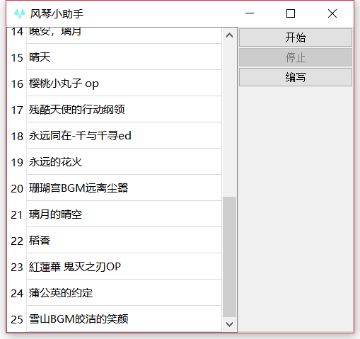

# 原神风琴小助手

## 一、项目概览

本项目开发环境：python3.8、windows 10

开发时游戏版本：2.6

### 1.1 快速启动

1. 安装 python 依赖。`pip install requirements.txt`
2. 启动，双击 manage.py 或  `python manage.py`

### 1.2 使用指南

#### 1.2.1 开始演奏/停止演奏

1. 单击左侧选择曲目
2. 点击开始（此时装载曲谱按键列表，注册快捷键，默认为 “F8”）
3. 按一次快捷键会演奏一个节拍，直到演奏结束，取消快捷键，重置状态。
4. 点击停止按钮，同样会取消快捷键并重置状态。

#### 1.2.2 编写曲谱

1. 点击编写按钮，进入曲谱编写页面。
2. 在编辑栏中输入 n 行曲谱按键。其中每一行代表着一次演奏中按下的所有按键。如 ”V“ 代表该次演奏只按了一个 ”V“ 键；而 ”VAW“ 则代表在这一次演奏中，按下了 ”V”、“A“，”W“ 三个按键。
3. 点击保存，若没有输入曲谱名，则会使用默认名字
4. 曲谱保存在 “/source/song/” 目录中。

### 1.3 曲谱来源

**指尖灬旋律丿**@bilibili https://space.bilibili.com/76052941
**呱呱瓜能有什么坏心思**@bilibili https://space.bilibili.com/16948034

**原琴玩家伊蕾娜**@bilibili https://space.bilibili.com/79355209

**小柴胡今天起床了吗**@bilibili https://space.bilibili.com/2576590

**bilibala**@Q群：654367882

## TODOs

- [x] 基础功能，手动演奏
- [ ] 读取 midi，自动演奏（整不明白 midi，也许不会有了）